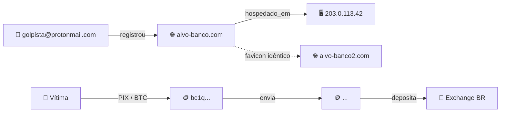

# Grafo de Conexões (Fase 3 — Processamento)

## Quando usar

- Investigação tem múltiplas entidades (pessoas, contas, IPs, wallets, domínios) com relações não triviais
- Preparar **Apêndice B** de `/gerar-relatorio`
- Exportação posterior para ferramentas visuais (Maltego, draw.io, Obsidian Canvas, Neo4j, Gephi)

## Protocolo

### 1. Solicite entidades e relações

Se o usuário fornecer dados brutos, extraia. Se fornecer lista estruturada, use direto.

**Entidades** (nós) — tipos suportados:
- `Pessoa` (física, jurídica)
- `E-mail`
- `Telefone`
- `CPF` / `CNPJ`
- `IP`
- `Domínio`
- `URL`
- `Username` / `Handle`
- `Wallet` (BTC, ETH, outros)
- `Hash` (de arquivo, de malware)
- `Perfil` (Instagram, Facebook, LinkedIn, Telegram, etc.)
- `Dispositivo` (IMEI, fingerprint)
- `Conta bancária`
- `Empresa`
- `Endereço físico`

**Relações** (arestas) — verbos padronizados:
- `registrou` (e-mail → domínio)
- `recebe_de` / `envia_para` (wallet → wallet)
- `usa` (pessoa → telefone, pessoa → e-mail)
- `hospedado_em` (domínio → IP)
- `assina_com` (domínio → certificado)
- `controla` (pessoa → CNPJ, pessoa → wallet)
- `mesmo_operador_que` (domínio → domínio, via favicon hash)
- `transacionou_com` (wallet → wallet, conta → conta)
- `vítima_de` / `autor_de` (pessoa → crime)
- `acessou_a_partir_de` (conta → IP, em timestamp)

### 2. Classifique cada aresta

- **FATO** — documentada por fonte objetiva
- **INFERÊNCIA** — hipótese de vínculo, com grau de confiança

### 3. Produza 3 representações

#### a) Tabela de arestas (fonte única de verdade)

Formato pronto para importar no Maltego/Neo4j via CSV.

#### b) Grafo textual ASCII

Visualização rápida no chat, útil para discussão.

#### c) Export sugerido

Formato Mermaid ou Maltego XML/Neo4j Cypher para importação imediata.

## Formato de saída obrigatório

```markdown
# 🕸️ GRAFO DE CONEXÕES — [caso]

**Procedimento:** [IPL nº]
**Data:** [UTC]
**Entidades totais:** [N]
**Arestas totais:** [M] (FATOS: [x], INFERÊNCIAS: [y])

---

## Tabela de entidades (nós)

| # | ID | Tipo | Rótulo | Notas |
|---|---|---|---|---|
| N1 | E1 | E-mail | `golpista@protonmail.com` | Atribuída ao operador H1 |
| N2 | D1 | Domínio | `alvo-banco.com` | Derrubado em 2026-04-15 |
| N3 | I1 | IP | `203.0.113.42` | Bulletproof hosting, AS12345 |
| N4 | W1 | Wallet BTC | `bc1q...` | Destino da primeira vítima |

## Tabela de arestas (relações)

| # | Origem | Relação | Destino | Fato/Inferência | Confiança | Fonte |
|---|---|---|---|---|---|---|
| 1 | E1 | `registrou` | D1 | FATO | ALTO | WHOIS Registro.br (captura 2026-04-19) |
| 2 | D1 | `hospedado_em` | I1 | FATO | ALTO | Passive DNS Circl.lu |
| 3 | D1 | `mesmo_operador_que` | D2 | INFERÊNCIA | MÉDIO-ALTO | Favicon hash idêntico (KB §12) |
| 4 | Vítima | `transacionou_com` | W1 | FATO | ALTO | Extrato bancário (ofício B1) |

---

## 🌳 Grafo textual ASCII (síntese)

```
E1 (golpista@protonmail.com)
 │
 ├─[registrou]──▶ D1 (alvo-banco.com)
 │                 │
 │                 ├─[hospedado_em]──▶ I1 (203.0.113.42, AS12345)
 │                 │                    │
 │                 │                    └─[reverse_ip]──▶ D3, D4, D5
 │                 │
 │                 └─[mesmo_operador_que, favicon]──▶ D2, D6
 │
 └─[outros_dominios_whoxy]──▶ D7, D8

Vítima ──[transacionou_com]──▶ W1 (BTC)
                                │
                                └─[envia_para]──▶ W2 ──▶ W3 (exchange BR)
```

---

## Export Mermaid (preview rápido)



---

## Export Neo4j Cypher

```cypher
CREATE (e1:Email {address: 'golpista@protonmail.com'});
CREATE (d1:Domain {name: 'alvo-banco.com', registered: '2026-04-10'});
CREATE (i1:IP {addr: '203.0.113.42', asn: 12345});
CREATE (w1:Wallet {addr: 'bc1q...', chain: 'BTC'});

MATCH (e:Email {address: 'golpista@protonmail.com'}),
      (d:Domain {name: 'alvo-banco.com'})
CREATE (e)-[:REGISTROU {source: 'WHOIS Registro.br', date_utc: '2026-04-19T10:00:00Z', confidence: 'ALTO'}]->(d);
-- [demais arestas análogas]
```

---

## Export Maltego (CSV de entidades e arestas)

Para importar via Maltego → Import/Export → CSV:

**entities.csv:**
```
ID,Type,Value,Notes
E1,EmailAddress,golpista@protonmail.com,H1
D1,Domain,alvo-banco.com,Derrubado 2026-04-15
...
```

**links.csv:**
```
Source,Target,Type,Weight,Notes
E1,D1,registrou,FATO,"WHOIS Registro.br"
...
```

---

## 📊 Síntese
├─ Entidades centrais (maior grau): [E1, D1, I1]
├─ Clusters identificados:
│   • Cluster A — operação do site falso (E1 + D1/D2 + I1)
│   • Cluster B — fluxo financeiro (Vítima → W1 → W2 → Exchange)
├─ Pontos de falha identificados:
│   • E1 é fulcro — ofício à plataforma de e-mail traz maior dano à operação
│   • Exchange BR é fulcro financeiro — ofício com identificação do titular
└─ Lacunas:
    • Sem ligação entre Cluster A e operador físico (quem controla E1)
    • W2 → Exchange sem MLAT ainda requisitado
```

## Regras

- **NUNCA** invente conexão — toda aresta precisa de fonte identificável.
- **SEMPRE** separe FATO (fonte objetiva) de INFERÊNCIA (hipótese).
- **SEMPRE** produza as 3 representações (tabela, ASCII, export). Usuário pode precisar de diferentes para diferentes finalidades.
- **Use convenções estáveis** para ID de nó (E1, D1, I1, W1, P1) — facilita crescimento incremental.
- **Para casos com wallets cripto:** siga `references/09-criptoativos.md` — cluster de wallets derivado de WalletExplorer/MetaSleuth é **INFERÊNCIA ALTA**, nunca FATO automático.
- **Para conexões por favicon hash:** MÉDIO-ALTO (falso positivo com templates) — ver `references/12-favicons.md`.
- **Não exporte dados sensíveis** (CPF completo, endereço residencial) para ferramenta de nuvem sem autorização institucional.
